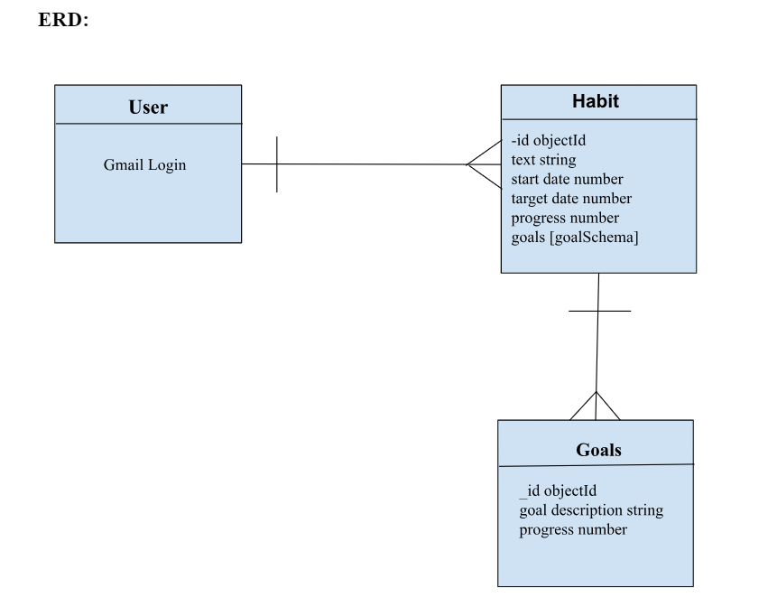
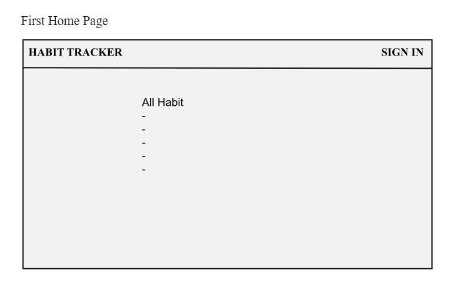
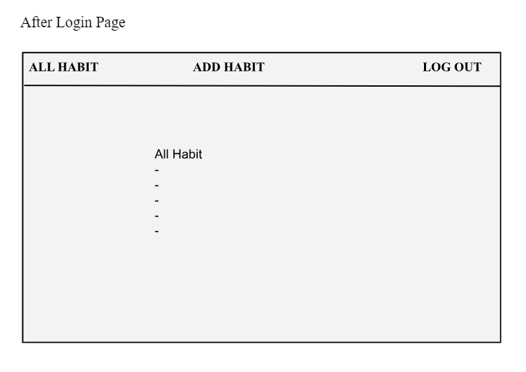
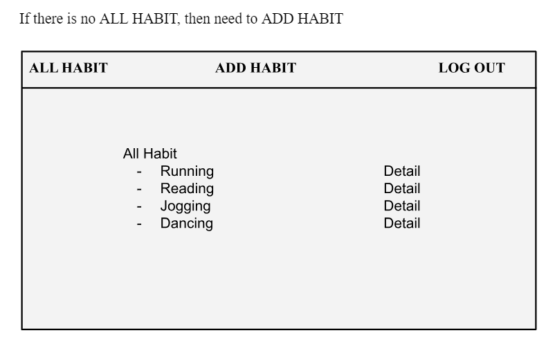
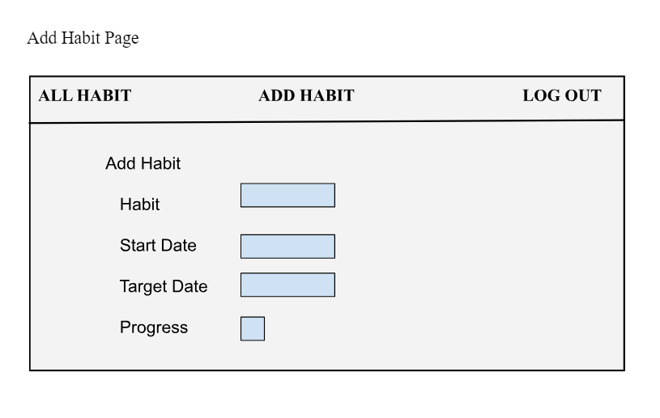
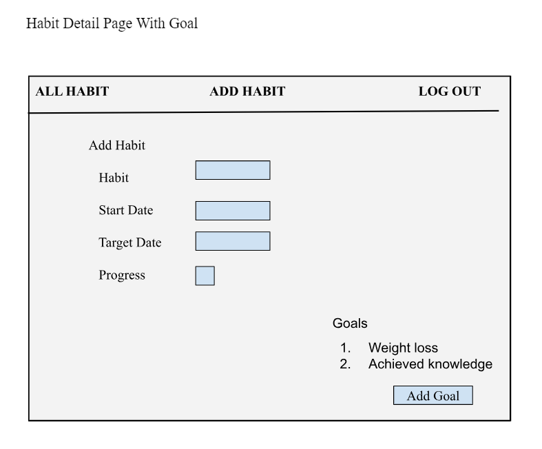

# Habit Tracker

Good habits can be hard to adopt and even harder to keep up. That’s where a habit tracker comes in. A habit tracker is a simple way to measure whether you have a habit or basically just recording the behavior you’re trying to change. People often use habit tracker to track exercise, taking medicine, cleaning, reading, and much more. Keeping a record of habit is important when trying to achieve a goal such as to stay motivated, keeps focus, or boosts confidence. 

I am not a disciplined person. As a mom, my days never look the same due to lack of discipline and forming habits can seem impossible. That’s why I love tracking my habits in order to stay focused every day on achieving my goals. After having babies, I gained a lot of weight. So, in order to motivate myself to lose weight, I made a habit of exercising, drinking water, cutting sugary products, and eating healthy foods.

## Screenshots:

## ERD

## Wireframes

## App's landing page

## Technologies Used:

- Express.js

- MongoDB

- Mongoose

- CSS

- HTML

- [Imgur](https://imgur.com/)

## Getting Started: How the app work

[Heroku](https://secure-caverns-00990-84bdba097217.herokuapp.com/)

[Trello Board](https://trello.com/b/5PMyu6jZ/project-2)

## Next Steps: 

- Add a calendar for goal track. 

- Sign up through different email can be done.

- Add CSS on curtain goals to make it more attractive.

